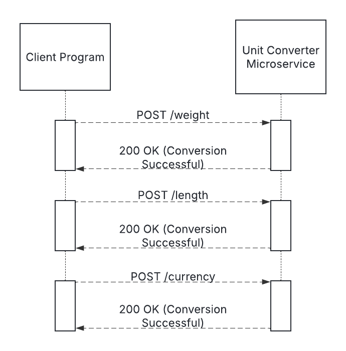

# Unit Conversion Microservice

## Overview
This microservice provides a weight, length, and currency conversions using a REST API. Clients can send a
weight, length, or currency conversion request with a source unit, target unit, and amount to convert.
404 Errors, which specify which unit is unknown, are provided if either the source or target unit is unknown.

The microservice can be run with "fastapi run main.py" and should default to http://localhost:8000.

Required packages are specified in requirements.txt and will be updated with pipreqs in any future versions as needed.

## API Examples

### Weight Conversions
Request to convert a weight amount
- **Method:** `POST`
- **Endpoint:** `/weight`
- **Request Body (JSON):**
    ```json
    {
        "source unit": <Abbreviated weight unit>
        "target unit": <Abbreviated weight unit>
        "amount": <Amount to convert>
    }
    ```
- **Response:** `200 OK`

#### Example Call (Python)
```python
import requests
import json

url = "http://localhost:8000/weight"
data = {"source_unit": 'oz', "target_unit": 'kg', "amount": "2342398.234"}
response = requests.post(url, json=data)
if response.status_code == 200:
    result = response.json()
    print(f"Response: {result}")
elif response.status_code == 404:
    json_data = json.loads(response.text)
    error = json_data["detail"]
    print(f"Error: {error}")
```


### Length Conversions
Request to convert a length amount
- **Method:** `POST`
- **Endpoint:** `/length`
- **Request Body (JSON):**
    ```json
    {
        "source unit": <Abbreviated length unit>
        "target unit": <Abbreviated length unit>
        "amount": <Amount to convert>
    }
    ```
- **Response:** `200 OK`

#### Example Call (Python)
```python
import requests
import json

url = "http://localhost:8000/length"
data = {"source_unit": 'm', "target_unit": 'mi', "amount": "234.23"}}
response = requests.post(url, json=data)
if response.status_code == 200:
    result = response.json()
    print(f"Response: {result}")
elif response.status_code == 404:
    json_data = json.loads(response.text)
    error = json_data["detail"]
    print(f"Error: {error}")
```

### Currency Conversions
Request to convert a currency amount
- **Method:** `POST`
- **Endpoint:** `/currency`
- **Request Body (JSON):**
    ```json
    {
        "source unit": <Abbreviated currency unit>
        "target unit": <Abbreviated currency unit>
        "amount": <Amount to convert>
    }
    ```
- **Response:** `200 OK`

#### Example Call (Python)
```python
import requests
import json

url = "http://localhost:8000/currency"
data = {"source_unit": "USD", "target_unit": "EUR", "amount": "153.24"}}
response = requests.post(url, json=data)
if response.status_code == 200:
    result = response.json()
    print(f"Response: {result}")
elif response.status_code == 404:
    json_data = json.loads(response.text)
    error = json_data["detail"]
    print(f"Error: {error}")
```

## UML Sequence Diagram


